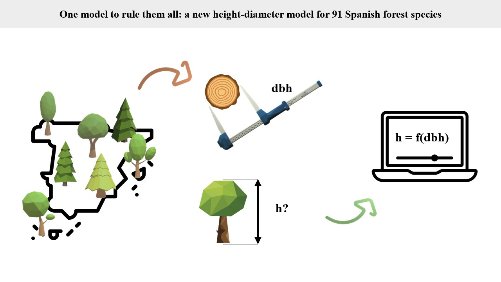
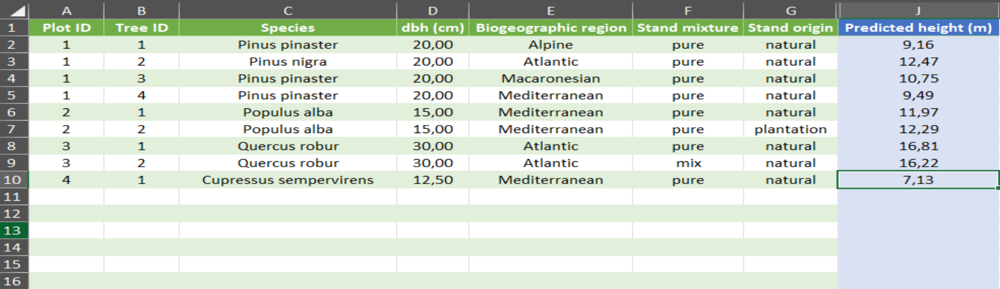

*Original data, code and results related to the scientific article titled*

# ***One model to rule them all: a nationwide height-diameter model for 91 Spanish forest species***

<!--:bulb: Have a look at the original poster  [here](http://dx.doi.org/10.13140/RG.2.2.27865.94564). -->

<!--
:bookmark: Poster DOI: <!-- http://dx.doi.org/10.13140/RG.2.2.27865.94564 -->

<!--
:open_file_folder: Repository DOI: <!--  -->

<!--
📜 Manuscript DOI: <!-- https://doi.org/10.1016/j.ecolmodel.2024.110912 -->

---

## :sparkles: Highlights 

- A total of 1,512,721 observations representing 91 species were collected from the Spanish National Forest Inventory.
- Ninety-five different baseline equations using dbh as the sole predictor were tested.
- A unified non linear mixed-effect model was fitted, incorporating all species and observations.
- Variables addressing stand origin, species mixture, and biogeographic region were included as fixed effects.
- The model is simple in structure, relies on easily measurable predictors and is well-suited for field applications.

## :book: Abstract

Developing reliable quantitative tools is essential for accurately monitoring and predicting tree and forest growth in the context of sustainable forest management. In common growth and yield modeling systems, diameter at breast height (dbh) and total tree height are key variables for estimating and predicting metrics such as total volume, biomass, and carbon content. However, measuring tree height in the field is more challenging and time-consuming compared to dbh. To address this, height-diameter (h-d) relationship models provide a practical alternative, enabling the estimation of tree heights using only dbh measurements.

In this study, new h-d models were developed for the main forest species in Spain. A total of 1,512,721 observations, representing 91 species, were collected from Spanish National Forest Inventory sample plots for analysis. The best baseline equations out of 95 alternatives using dbh as a unique predictor was selected to fit a unique non linear mixed-effect model. The results indicate that different equations can achieve similar levels of performance. Furthermore, incorporating variables such as stand origin, species mixture, and biogeographic region enhances model predictability, particularly when applied across broad geographic areas.

The proposed models are simple in structure and rely on easily obtainable predictors, making them practical for field application and minimizing the need for complex measurements. Their integration into widely-used forest growth and yield simulators, such as SIMANFOR, further facilitates their adoption by forest practitioners and managers, supporting informed and effective forest management decisions.

## :dart: Graphical abstract

---

## 🛠 Tools developed

:point_right: As an outcome of this work, you can utilize the following resources available [here](./tools/):

-  ***A new [SIMANFOR](www.simanfor.es) model***: the model developed in this study was implemented into the simulator. You can access it by selecting the *Calcular alturas* model during the scenario creation screen. Additionally, models without a specific height-diameter equation will use it when needed. Check the [models documentation](https://github.com/simanfor/modelos) for more information
- :computer: :1234: ***Excel calculator***: explore that [*Excel calculator file*](./tools/) (both English and Spanish) to run the models developed in this study without effort

- :computer: :scientist: ***R functions***: explore these [*R functions*](./tools/) to run the models developed in this study without needing to code
- :computer: :snake: ***Python functions***: explore these [*Python functions*](./tools/) to run the models developed in this study without needing to code
  
---

## :file_folder: Repository Contents

- :open_file_folder: [***bibliography***](./bibliography/): compilation of all the literature cited or consulted during the creation of the document
- :open_file_folder: [***data***](./data/): raw and processed data, check [here](./data/README.md) for a detailed description
- :open_file_folder: [***output***](./output/): figures, charts, tables and additional resources included in the document, check [here](./output/README.md) for a detailed description
- :open_file_folder: [***scripts***](./scripts/): compilation of the code used for data curation, analysis and outputs included in the document, check [here](./scripts/README.md) for a detailed description
- :open_file_folder: [***tools***](./tools/): resources developed trough this study, check [here](./tools/README.md) for a detailed description
  
---

## :thinking: How to use the resouces of that repository

:dizzy: To download the information of that repository, you can follow this [guide](https://docs.github.com/en/repositories/working-with-files/using-files/downloading-source-code-archives).

:recycle: To reproduce the analysis, users must:

- :floppy_disk: **Data**: 
  - :sunny: WorldClim data required must be downloaded from its [official website](https://www.worldclim.org/data/index.html)
  - :deciduous_tree::evergreen_tree: Spanish Forest National Inventory (SFNI) data required must be downloaded from its [official website](https://www.miteco.gob.es/es/biodiversidad/temas/inventarios-nacionales/inventario-forestal-nacional.html), through the links above, or accessed via this [GitHub repository](https://github.com/aitorvv/SFNI_Spanish_Forest_National_Inventory-ready_to_use/) 

- :computer: **Prerequisites: installation and code**: *[R](https://cran.r-project.org/bin/windows/base/)* must be installed to run the code with the libraries used in each script. *[RStudio](https://posit.co/download/rstudio-desktop/)* was used to develop the code. Some analyses may require high computational power, which could lead to out-of-memory issues on a standard computer. Access to high-performance computing services is strongly recommended in such cases.

- :scroll: **Usage**: follow the numerical order of the scripts to reproduce each step correctly

---

## :books:     Additional Information

To better understand how SIMANFOR works, you can explore its [website](https://www.simanfor.es/), [GitHub repository](https://github.com/simanfor), [manual](https://github.com/simanfor/manual), [YouTube playlist](https://www.youtube.com/playlist?list=PLsdzTKpJZZa7vn5zGpn07-bd0Nce-fMhJ) or even the [last paper](https://doi.org/10.1016/j.ecolmodel.2024.110912). 

---

## ℹ License

The content of this repository is under the [MIT license](./LICENSE).

---

## 🔗 About the authors

#### Aitor Vázquez Veloso:

 

#### Sheng-I Yang:

 

 
 
 

#### Bronson P. Bullock:

 

 
 
 

#### Felipe Bravo Oviedo:

 

 
 
 
 

---

[One model to rule them all: a nationwide height-diameter model for 91 Spanish forest species](https://github.com/aitorvv/height-diameter_models_Spain) 

