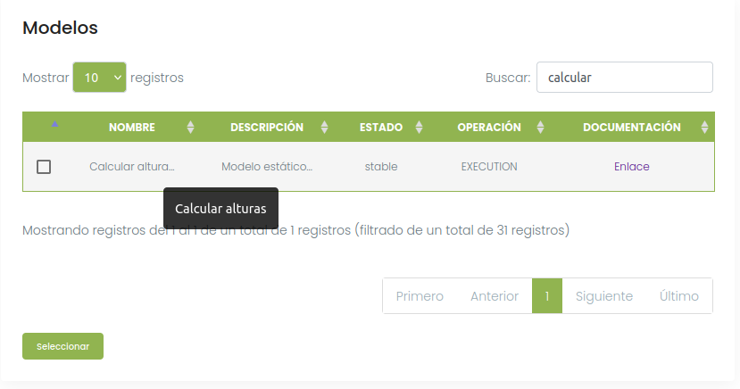
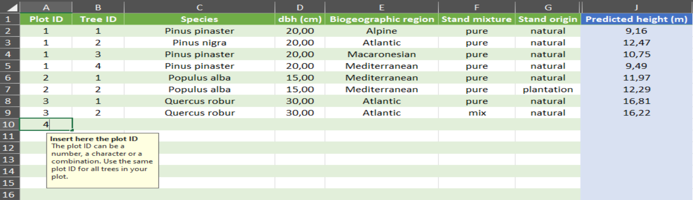
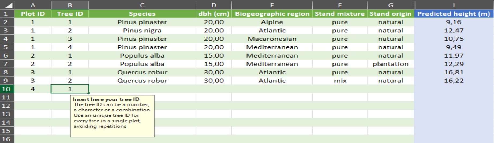
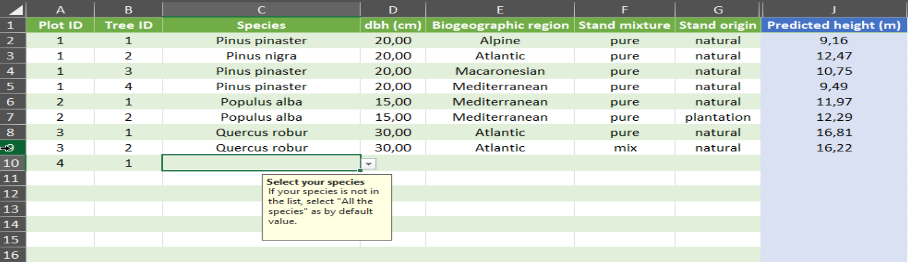
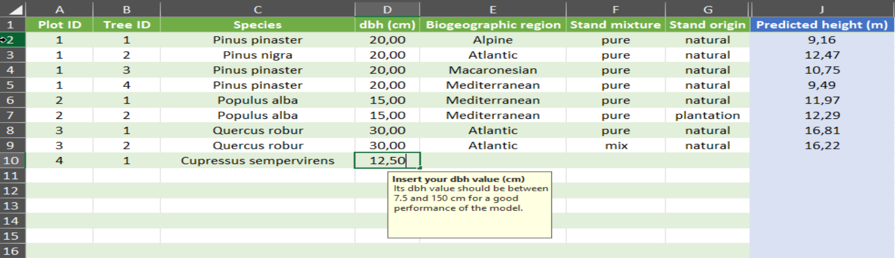
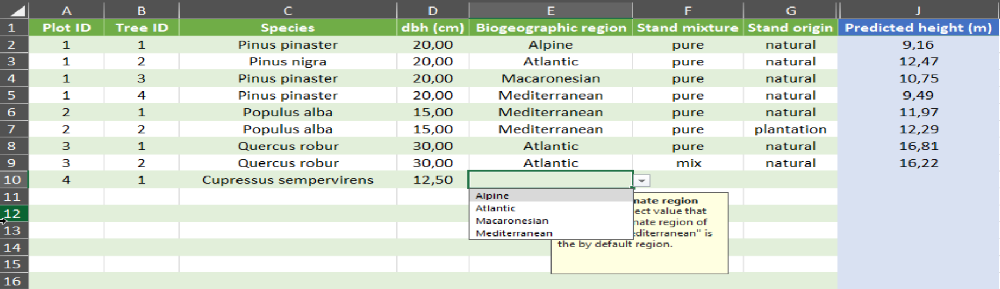
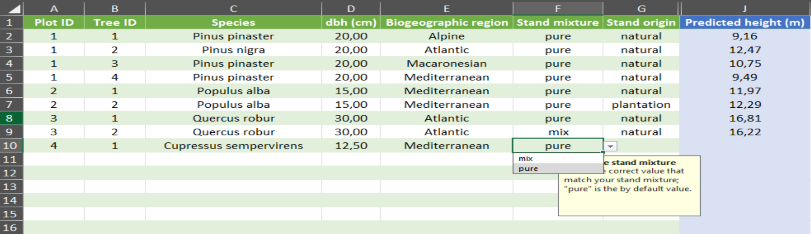
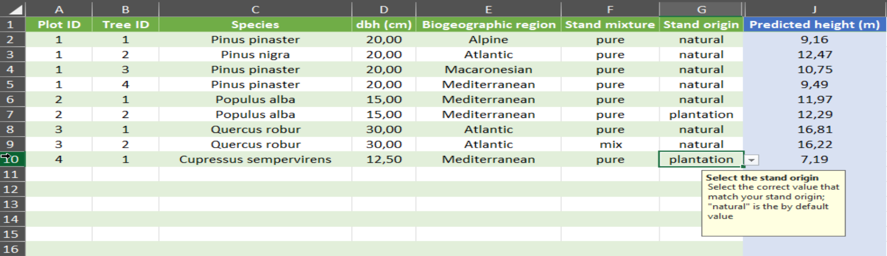
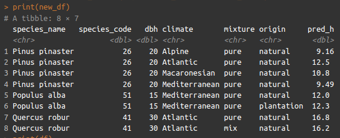
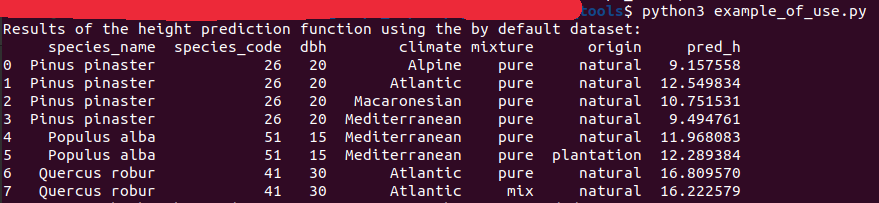

*Original data, code and results related to the scientific article titled*

# ***One model to rule them all: a nationwide height-diameter model for 91 Spanish forest species***

## :file_folder: Folder Content

The model and its parameterization for the different species and stand characteristics was included in different ready-to-use tools to promote its usability, including: 

-  ***A new [SIMANFOR](www.simanfor.es) model***: the model developed in this study was implemented into the simulator. You can access it by selecting the *Calcular alturas* model during the scenario creation screen. Additionally, models without a specific height-diameter equation will use it when needed. Check the [models documentation](https://github.com/simanfor/modelos) for more information

- :computer: :1234: ***Excel calculator***: explore the *Excel calculator* (available in both [English](EN_one_model_to_rule_them_all.xlsx) and [Spanish](ES_one_model_to_rule_them_all.xlsx) versions) to run the models developed in this study effortlessly. To use it, you have to:
  - :1234: insert the plot ID (optional)

  - :1234: insert the tree ID (optional)

  - :deciduous_tree: select a species from the list (91 species)

  - :wood: enter its dbh (cm)

  - :earth_africa: select the correct biogeographic region of the list

  - choose whether your stand is :deciduous_tree::deciduous_tree: pure or :deciduous_tree::evergreen_tree: mixed 

  - select whether the origin of the stand is natural :mountain: or artificial (plantation) :microscope:

  - :bulb: each box contains text to guide you, don't worry

- :computer: :scientist: ***R functions***: explore these *R functions* to run the models developed in this study without needing to code

	- :computer: :scientist: [***one_model_to_rule_them_all.r***](one_model_to_rule_them_all.r) includes the functions needed to run the model
	- :computer: :scientist: [***example_of_use.r***](example_of_use.r) provides an example R script for estimating tree height

- :computer: :snake: ***Python functions***: explore these [*Python functions*](./tools/) to run the models developed in this study without needing to code

	- :computer: :snake: [***one_model_to_rule_them_all.py***](one_model_to_rule_them_all.py) includes the functions needed to run the model
	- :computer: :snake: [***example_of_use.py***](example_of_use.py) provides an example Python script for estimating tree height

